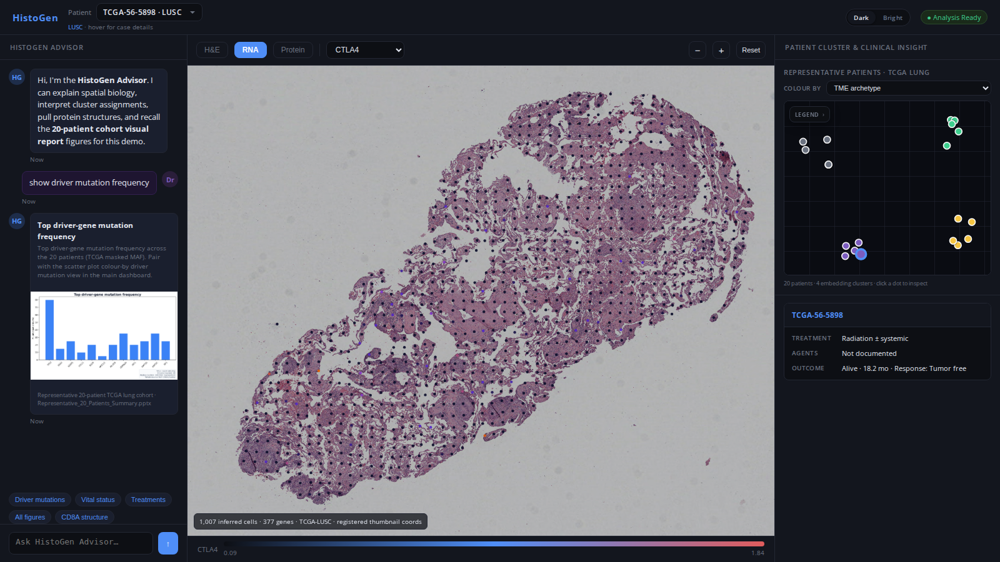

# HistoGEN-NucleateNY-NextGen-BioAgents-Hackathon

Hackathon project for [**Nucleate NY NextGen BioAgents Hackathon**](https://www.nucleatebiohack.org/about-biohack).

**HistoGEN** is a clinical AI workflow that starts from routine H&E, infers virtual
spatial biology, retrieves similar patients, and drafts a citation-backed molecular
tumor board report.



The active model stack is **PHOENIX**, **GigaTIME**, and **Haiku** (joint H&E +
clinical-text encoder for patient similarity). The **HistoGen Advisor** chat is
a separate clinical LLM layer (mock stubs in the demo UI). All active development
lives on **`main`**.

## Stack

| Layer | Tool | Role |
|-------|------|------|
| Virtual spatial transcriptomics | [PHOENIX](https://huggingface.co/peng-lab/phoenix) | Virtual spatial RNA **inference** on your H&E |
| Virtual multiplex protein (mIF) | [GigaTIME](https://huggingface.co/prov-gigatime/GigaTIME) | H&E → 21-channel virtual mIF for TME phenotyping |
| Patient similarity | **Haiku** | Joint encoder of H&E + clinical text → embeddings, cluster assignment, nearest-neighbor search |
| Clinical agent chat | **HistoGen Advisor** (LLM) | Conversational interface; demo uses mock replies |

## Repository layout

```
demo/                    20-patient TCGA demo cohort (bundles, visual report, gitignored WSI/demo AnnData)
data/
  tcga_lung/             Full-cohort manifests, download, slide IO, light Zarr
  phoenix/               PHOENIX weights fetch, inference, demo AnnData extract, registration
  gigatime/              GigaTIME weights fetch helper (gated HF)
scripts/
  run_ui.sh              Start HistoGEN Advisor (:8080)
  start_public_ui.sh     Cloudflare tunnel fallback
  demo/                  One-command demo pipeline (GPU)
ui/
  index.html             HistoGEN Advisor dashboard (only UI)
  protein_server.py      FastAPI: protein structures, PHOENIX RNA, cohort figures
docs/
  UI.md                  Single-UI policy, run instructions, PHOENIX viewer notes
  assets/                README screenshots
```

## Quick start

### HistoGEN Advisor (only UI)

```bash
bash scripts/run_ui.sh
# → http://localhost:8080
```

One app on port **8080**:

- **HistoGen Advisor chat** — protein structure cards, embedded cohort figure plots
- **Center viewer** — H&E + PHOENIX RNA overlay (contour+flow registered coords) + protein mode
- **Right panel** — 20-patient cluster graph, similar patients, clinical tags

Details: [`docs/UI.md`](docs/UI.md). Public tunnel: `bash scripts/start_public_ui.sh`

### Demo cohort (20 patients)

The bundled demo uses a stratified subset of **20 open-access TCGA lung diagnostic
H&E slides** (LUAD + LUSC). See `demo/README.md`.

Full demo pipeline (GPU + `HF_TOKEN` for GigaTIME):

```bash
bash scripts/demo/build_all.sh
```

Or step by step:

```bash
python scripts/demo/fetch_wsi.py
python scripts/demo/fetch_phoenix.py              # model weights (~5 GB)
python scripts/demo/fetch_demo_atlas.py           # demo-only TCGA AnnData (~23 GB)
python scripts/demo/run_phoenix.py --demo-atlas   # AnnData → CSV + H&E registration
python scripts/demo/run_gigatime.py
python scripts/demo/run_haiku.py
python scripts/demo/build_ui_assets.py --skip-download
bash scripts/run_ui.sh
```

### General (full cohort) data

**TCGA lung H&E** — manifests and download for all ~1,053 diagnostic slides:

```bash
cd data/tcga_lung
pip install -r requirements.txt
python download.py --manifest gdc_manifest.tcga_lung.txt --out-dir ./WSI --dry-run --limit 3
```

**PHOENIX** — inference on your own H&E:

```bash
cd data/phoenix && pip install -r requirements.txt
python fetch.py                               # model weights (~5 GB)
python inference.py --svs slide.svs --out-dir ./outputs/my_case
python fetch_demo_atlas.py                    # demo-only TCGA AnnData (~23 GB)
```

**GigaTIME weights** (gated — accept terms at [prov-gigatime/GigaTIME](https://huggingface.co/prov-gigatime/GigaTIME)):

```bash
export HF_TOKEN=hf_...
cd data/gigatime
pip install -r requirements.txt
python fetch.py
```

## Agents

Cloud and Cursor agents should read **`AGENTS.md`** first. It documents demo vs
general paths, the single-UI policy, required secrets, and GPU assumptions.

## License notes

**HistoGEN and this repository are intended for non-commercial research and
education only.** Several bundled models and datasets carry non-commercial or
no-derivatives terms; do not use outputs in commercial products or clinical
decision-making without separate license review.

- **GigaTIME** — research-only, gated Hugging Face repo; **do not commit weights**
  or redistribute the checkpoint.
- **PHOENIX** — [CC-BY-NC-ND-4.0](https://huggingface.co/datasets/peng-lab/phoenix)
  (non-commercial, no derivatives).
- **TCGA** — The Cancer Genome Atlas provides open-access diagnostic H&E whole-slide
  images via the [NCI Genomic Data Commons (GDC)](https://portal.gdc.cancer.gov/).
  Slides are de-identified research specimens contributed under controlled-access
  policies; the **demo/** folder ships metadata and derived readouts for 20 lung
  cases only. Downloading the full lung cohort (~824 GB) is optional and handled
  by `data/tcga_lung/download.py`, not required to run the UI demo.
